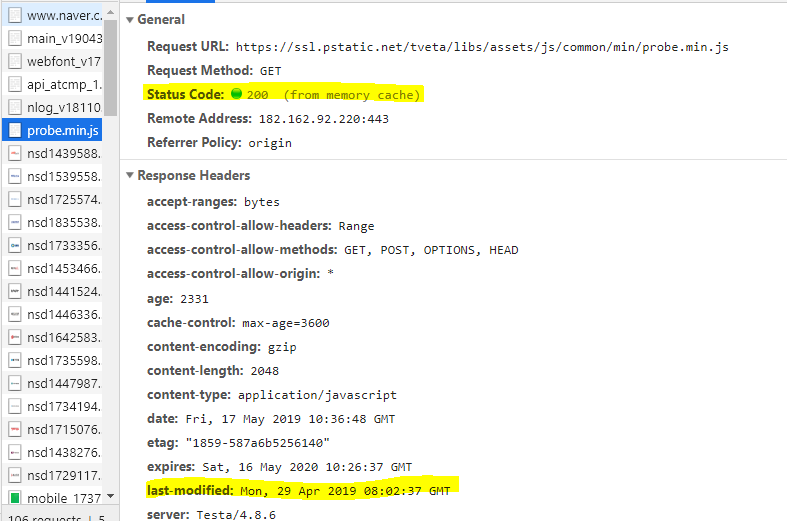

# 캐시:moneybag:  적용에서의 고속화 :fire:

> 고속화 중에서 가장 효과적인 것은 처리를 하지 않는 것이다. 그러기 위해서는 처리 결과를 재사용하는 캐시가 효과적이다. 

### 캐싱의 순서

1. 브라우저에서 필요한 리소스를 서버에 최초로 요청한다.
2. 서버에서 응답헤더에 **Last-Modified** 헤더를 셋팅하여 요청한 리소스와 함께 내려보내면, 브라우저는 해당 리소스의 복사본을 생성하여 저장한다.
3. 브라우저에서 해당 리소스를 **재요청**할 경우에는 서버에서 **Last-Modified** 헤더에 **If-Modified-Since** 헤더에 포함시켜 서버에 요청한다.
4. 서버에서는 **If-Modified-Since** 헤더 값을 통해 해당 리소스가 변경되었으면 **Last-Modified** 헤더에 최신 수정날짜를 설정하여 파일을 전달한다. 변경되지 않은 경우 **304 http 상태코드** 로 응답하면 브라우저는 기존에 저장한 값을 재사용하게 된다.

### Cache-Control

`Cache-Control: private, max-age=<유효기간(초)>`

--> 유효기간 동안 브라우저에 캐시하게 된다.

#### private

브라우저같은 특정 사용자 환경에만 저장하라.

#### public

공유캐시/중개서버에 저장해도 된다.

## Last-Modified & ETag

> 캐시의 유효성 검사 ( 갱신이 필요 유무).

### Last-Modified 헤더

브라우저가 서버로 요청한 파일의 최종 수정 시간을 알려주는 헤더. 브라우저가 다음에 다시 접속 할 떄, 서버에게 파일이 또 수정되었는지 물어보게 되는데 이때 서버가 수정여부를 내려주는 헤더가 **If-Modified-Since** 헤더이다. 

이미지/CSS/JS와 같은 정적파일들은 아파치에서 자동적으로 **Last-Modified**, **If-Modified-Since** 헤더를 붙여준다. 동적 파일은 로직상에서 헤더를 붙여 주면 된다.

### ETag

> 서버에서 제공되는 컨텐츠의 식별번호로 이해하자.
>
> 웹 서버에서 제공하는 컨텐츠 들은 각각의 고유 식별 정보를 가지고 있다 --> ETag
>
> 캐시서버와 웹 브라우저는 이 정보를 이용해서 캐싱된 내용들이 갱신이 필요한 지 결정하게 된다.

www.cafe24.com의 응답 본문이 "안녕" 이고 ETag 값이 123이라고 치자.

서버 컨텐츠의 응답본문이 변함없이 "안녕" 이라면 ETag값 또한 계속 123이다.  --> 클라이언트는 서버로 요청을 할때마다 이 ETag값을 함께 보낼 수 있다. (아마 설정해야하는듯)

그런데 어느 순간 응답 본문이 "hello"로 바뀌었다면 ETag 값 또한 123이 아닌 다른 값으로 바뀐다. 이때 서버는 클라이언트가 리소스의 갱신이 필요함을 알게된다:+1:

- Last-Modified 와 동시에 사용된다면 ETag값을 우선시 한다. 마지막 수정 날짜를 확인하기 어려운 경우 사용

- **If-None-Match** 헤더를 통해 사용한다.

  - `If-None-Match: "17f0ddd99ed5bbe4edffdd6496d7131f` --> ETag 값 ( 해시된 값이라고 한다.)

    서버의 버전이 목록의 ETag 값과 일치하면 304를 리턴함. 다른 경우 200값과, 갱신이 필요한 리소스를 응답한다.

- 여러 서버에서 하나의 페이지를 처리할때, 다른 ETag 값을 가지게 된다. 어떻게 처리할 수 있을까???

**Cache control**, **Last-Modified**, **ETag** 중 **Last-Modified**, **ETag** 는 API 호출에 사용할 수 있다.